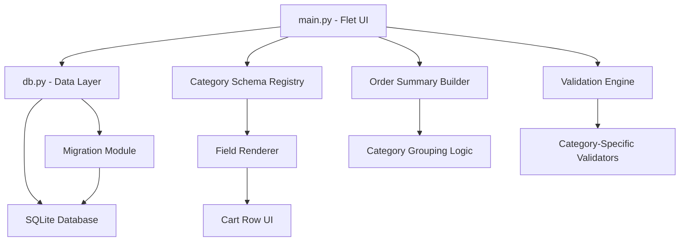

# Design Document: Multi-Category Orders

## Overview

This feature extends the existing Chuda-only order system to support five product categories (Chuda, Kaleera, Raw_Material, Metal_Bangles, Seasonal), each with its own set of order attributes. The order form dynamically adapts its input fields based on the selected item's category, while maintaining backward compatibility with existing Chuda workflows.

The design follows a schema-driven approach: each category defines a "field schema" that dictates which UI controls appear in a cart row. The database is extended with category/sub_category columns and item-level attribute storage, with an idempotent migration path for existing data.

## Architecture



**Key architectural decisions:**

1. **Category Schema Registry (in-memory dict):** A Python dictionary mapping each category to its field definitions, validation rules, and line-total formula. This avoids complex inheritance and keeps the logic declarative.

2. **Single-file approach:** All new logic lives in `db.py` (schema, migration, queries) and `main.py` (UI rendering, validation). No new files are introduced to keep the project simple and aligned with the existing structure.

3. **Item-level attribute storage:** Moving color, grind_type, box_type from order-level to item-level in `order_items` allows mixed-category orders while preserving backward compatibility via migration.

## Components and Interfaces

### Category Schema Registry

```python
# In main.py — defines the field configuration per category

CATEGORIES = ["Chuda", "Kaleera", "Raw_Material", "Metal_Bangles", "Seasonal"]
SUB_CATEGORIES = {"Raw_Material": ["Patti", "Nihar", "Box", "Bhawari"]}

CATEGORY_SCHEMAS = {
    "Chuda": {
        "fields": ["color", "grind_type", "box_type", "sizes"],
        "sizes": ["2.2", "2.4", "2.6", "2.8", "2.10"],
        "line_total": "sum_sizes_x_price",
        "validation": "at_least_one_size_gt_zero",
    },
    "Kaleera": {
        "fields": ["color", "quantity"],
        "qty_range": (1, 9999),
        "qty_type": "int",
        "line_total": "qty_x_price",
        "validation": "qty_gte_1_and_color_required",
    },
    "Raw_Material": {
        "fields": ["sub_category_label", "quantity", "unit"],
        "qty_range": (0.01, 99999.99),
        "qty_type": "float",
        "units": ["pieces", "kg", "meters"],
        "default_unit": "pieces",
        "line_total": "qty_x_price",
        "validation": "qty_gt_zero",
    },
    "Metal_Bangles": {
        "fields": ["color", "sizes"],
        "sizes": ["2.2", "2.4", "2.6", "2.8", "2.10"],
        "line_total": "sum_sizes_x_price",
        "validation": "at_least_one_size_gt_zero",
    },
    "Seasonal": {
        "fields": ["quantity", "notes"],
        "qty_range": (1, 99999),
        "qty_type": "int",
        "notes_max_length": 500,
        "line_total": "qty_x_price",
        "validation": "qty_gte_1",
    },
}
```

### Database Layer Extensions (db.py)

```python
# New public API additions:

def init_db():
    """Extended to create new columns and run migration."""

def add_rate_item(item_number, image_path, cost_price, selling_price,
                  category, sub_category=None) -> bool:
    """Extended with category and sub_category params."""

def update_item_category(item_number, category, sub_category=None) -> bool:
    """Update category/sub_category for an existing item."""

def set_item_availability(item_number, is_available: bool) -> bool:
    """Toggle is_available flag for seasonal item lifecycle."""

def get_available_items(category=None) -> list[dict]:
    """Return items where is_available=True, optionally filtered by category."""

def create_order(header, line_items) -> int:
    """Extended: line_items now include item-level color, grind_type, box_type,
    quantity, unit, notes fields."""

def get_order_items(order_id) -> list[dict]:
    """Extended to return item-level attributes and category info."""

def run_migration():
    """Idempotent migration: sets NULL categories to Chuda,
    copies order-level attributes to order_items."""
```

### Validation Engine (main.py)

```python
def validate_cart_item(item: dict, category: str) -> str | None:
    """Returns error message string if invalid, None if valid.
    Dispatches to category-specific validation based on CATEGORY_SCHEMAS."""

def validate_order(cart: list, rate_lookup: dict) -> str | None:
    """Validates entire order. Returns first error found or None."""
```

### Line Total Calculator (main.py)

```python
def calculate_line_total(item: dict, category: str, unit_price: float) -> float:
    """Pure function. Returns line total based on category formula.
    - size-based: sum of size quantities × unit_price
    - quantity-based: quantity × unit_price"""
```

### Order Summary Builder (main.py)

```python
def build_order_summary(cart: list, rate_lookup: dict) -> dict:
    """Returns {
        'groups': [{'category': str, 'items': list, 'subtotal': float, 'count': int}],
        'grand_total': float
    }
    Groups are sorted alphabetically. Empty groups are excluded."""
```

### Dynamic Form Renderer (main.py)

```python
def build_category_fields(category: str, item_data: dict, callbacks: dict) -> list:
    """Returns list of Flet controls appropriate for the given category.
    Uses CATEGORY_SCHEMAS to determine which fields to render."""
```

## Data Models

### rate_list Table (Extended)

```sql
CREATE TABLE IF NOT EXISTS rate_list (
    id INTEGER PRIMARY KEY AUTOINCREMENT,
    item_number TEXT UNIQUE NOT NULL,
    image_path TEXT,
    cost_price REAL NOT NULL,
    selling_price REAL NOT NULL,
    card_path TEXT DEFAULT NULL,
    category TEXT NOT NULL DEFAULT 'Chuda',
    sub_category TEXT DEFAULT NULL,
    is_available INTEGER NOT NULL DEFAULT 1
);
```

### orders Table (Unchanged)

```sql
CREATE TABLE IF NOT EXISTS orders (
    order_id INTEGER PRIMARY KEY AUTOINCREMENT,
    customer_name TEXT NOT NULL,
    order_date TEXT NOT NULL,
    color TEXT,
    grind_type TEXT,
    box_type TEXT,
    packing_structure TEXT,
    additional_info TEXT,
    total_amount REAL DEFAULT 0
);
```

The order-level `color`, `grind_type`, `box_type` fields are retained for backward compatibility and serve as defaults for Chuda-only orders.

### order_items Table (Extended)

```sql
CREATE TABLE IF NOT EXISTS order_items (
    id INTEGER PRIMARY KEY AUTOINCREMENT,
    order_id INTEGER NOT NULL,
    item_number TEXT NOT NULL,
    category TEXT NOT NULL DEFAULT 'Chuda',
    qty_2_2 INTEGER DEFAULT 0,
    qty_2_4 INTEGER DEFAULT 0,
    qty_2_6 INTEGER DEFAULT 0,
    qty_2_8 INTEGER DEFAULT 0,
    qty_2_10 INTEGER DEFAULT 0,
    quantity REAL DEFAULT NULL,
    unit TEXT DEFAULT NULL,
    color TEXT DEFAULT NULL,
    grind_type TEXT DEFAULT NULL,
    box_type TEXT DEFAULT NULL,
    notes TEXT DEFAULT NULL,
    unit_price REAL DEFAULT 0,
    FOREIGN KEY (order_id) REFERENCES orders(order_id)
);
```

### Cart Item In-Memory Structure

```python
cart_item = {
    "uid": int,              # unique row identifier
    "item_number": str,      # from rate_list
    "category": str,         # derived from rate_list lookup
    # Size-based (Chuda, Metal_Bangles):
    "qty_2_2": int,
    "qty_2_4": int,
    "qty_2_6": int,
    "qty_2_8": int,
    "qty_2_10": int,
    # Quantity-based (Kaleera, Raw_Material, Seasonal):
    "quantity": float | None,
    "unit": str | None,      # Raw_Material only
    # Shared:
    "color": str | None,
    "grind_type": str | None,  # Chuda only
    "box_type": str | None,    # Chuda only
    "notes": str | None,       # Seasonal only
}
```

### Migration Strategy

```python
def run_migration():
    """Idempotent migration executed during init_db()."""
    conn = _conn()
    cur = conn.cursor()
    
    # Step 1: Add new columns to rate_list (safe — ALTER ignores if exists)
    _safe_add_column(cur, "rate_list", "category", "TEXT NOT NULL DEFAULT 'Chuda'")
    _safe_add_column(cur, "rate_list", "sub_category", "TEXT DEFAULT NULL")
    _safe_add_column(cur, "rate_list", "is_available", "INTEGER NOT NULL DEFAULT 1")
    
    # Step 2: Add new columns to order_items
    _safe_add_column(cur, "order_items", "category", "TEXT NOT NULL DEFAULT 'Chuda'")
    _safe_add_column(cur, "order_items", "quantity", "REAL DEFAULT NULL")
    _safe_add_column(cur, "order_items", "unit", "TEXT DEFAULT NULL")
    _safe_add_column(cur, "order_items", "color", "TEXT DEFAULT NULL")
    _safe_add_column(cur, "order_items", "grind_type", "TEXT DEFAULT NULL")
    _safe_add_column(cur, "order_items", "box_type", "TEXT DEFAULT NULL")
    _safe_add_column(cur, "order_items", "notes", "TEXT DEFAULT NULL")
    
    # Step 3: Migrate existing rate_list items (idempotent — only updates NULLs)
    cur.execute("UPDATE rate_list SET category = 'Chuda' WHERE category IS NULL")
    
    # Step 4: Copy order-level attributes to order_items where NULL
    cur.execute("""
        UPDATE order_items SET
            color = (SELECT o.color FROM orders o WHERE o.order_id = order_items.order_id),
            grind_type = (SELECT o.grind_type FROM orders o WHERE o.order_id = order_items.order_id),
            box_type = (SELECT o.box_type FROM orders o WHERE o.order_id = order_items.order_id)
        WHERE color IS NULL
    """)
    
    conn.commit()
    conn.close()
```

## Correctness Properties

*A property is a characteristic or behavior that should hold true across all valid executions of a system — essentially, a formal statement about what the system should do. Properties serve as the bridge between human-readable specifications and machine-verifiable correctness guarantees.*

### Property 1: Size-based line total calculation

*For any* category with size-based quantities (Chuda or Metal_Bangles), and *for any* combination of non-negative integer size quantities (each 0–9999) and a non-negative unit price, the line total SHALL equal the sum of all size quantities multiplied by the unit price.

**Validates: Requirements 2.4, 5.3**

### Property 2: Quantity-based line total calculation

*For any* category with a single quantity field (Kaleera, Raw_Material, or Seasonal), and *for any* valid quantity value within the category's allowed range and a non-negative unit price, the line total SHALL equal quantity multiplied by the unit price.

**Validates: Requirements 3.3, 4.3, 6.3**

### Property 3: Category assignment is mandatory

*For any* rate list item data with a valid item_number, cost_price, and selling_price, saving the item SHALL succeed only when exactly one valid category is provided, and SHALL fail when category is NULL or not in the allowed set.

**Validates: Requirements 1.2, 1.3**

### Property 4: Raw_Material requires valid sub_category

*For any* rate list item with category "Raw_Material", saving SHALL succeed only when sub_category is one of [Patti, Nihar, Box, Bhawari], and SHALL fail when sub_category is NULL or not in the allowed set.

**Validates: Requirements 1.4**

### Property 5: Availability filtering

*For any* set of rate list items with varying is_available values, the item selection list SHALL contain exactly those items where is_available is true, regardless of category.

**Validates: Requirements 7.1, 7.2**

### Property 6: Category determines rendered field set

*For any* item with a known category, the set of attribute fields rendered in the cart row SHALL exactly match the fields defined in the category schema for that category, with no extra or missing fields.

**Validates: Requirements 8.1, 9.2**

### Property 7: Category change clears previous attribute values

*For any* cart row where the selected item changes from one category to a different category, all previously entered attribute values (color, grind_type, box_type, quantities, unit, notes) SHALL be reset to their default/empty state.

**Validates: Requirements 8.2**

### Property 8: Migration sets NULL categories to Chuda

*For any* set of existing rate_list rows where category is NULL, after running migration, all such rows SHALL have category set to "Chuda" and all other fields SHALL remain unchanged.

**Validates: Requirements 10.4**

### Property 9: Migration copies order-level attributes to item-level

*For any* existing order_items row where color, grind_type, or box_type is NULL, after running migration, those fields SHALL equal the corresponding values from the parent order's header.

**Validates: Requirements 10.5**

### Property 10: Migration idempotence

*For any* database state, running the migration function twice SHALL produce the same result as running it once — no errors, no data changes on the second run.

**Validates: Requirements 10.6**

### Property 11: Order summary grouping and aggregation

*For any* non-empty set of cart line items with known categories and unit prices, the order summary SHALL: (a) group items by category in alphabetical order, (b) report the correct item count per group, (c) compute each group's subtotal as the sum of its line totals, (d) compute the grand total as the sum of all subtotals, and (e) exclude any category with zero items.

**Validates: Requirements 11.1, 11.2, 11.4**

### Property 12: Input sanitization for size quantities

*For any* input value that is non-numeric or negative provided to a size quantity field (Metal_Bangles or Chuda), the system SHALL treat it as 0.

**Validates: Requirements 5.4**

### Property 13: Kaleera validation requires quantity and color

*For any* Kaleera cart line item, validation SHALL fail if quantity is less than 1 OR if no color is selected, and SHALL pass when both conditions are met.

**Validates: Requirements 3.4**

### Property 14: Raw_Material quantity range validation

*For any* numeric value, the Raw_Material quantity validator SHALL accept values in [0.01, 99999.99] with at most 2 decimal places, and SHALL reject values outside this range or with more than 2 decimal places.

**Validates: Requirements 4.2**

### Property 15: Seasonal notes length validation

*For any* string, the Seasonal notes validator SHALL accept strings of length 0 to 500 characters and SHALL reject strings exceeding 500 characters.

**Validates: Requirements 6.2**

## Error Handling

| Scenario | Behavior |
|----------|----------|
| Save rate item without category | Prevent save, show "Category is required" |
| Save Raw_Material item without sub_category | Prevent save, show "Sub-category is required for Raw Material" |
| Chuda/Metal_Bangles with all sizes = 0 | Prevent order save, show "At least one size must have quantity > 0" |
| Kaleera with qty < 1 | Prevent order save, show "Quantity must be at least 1" |
| Kaleera with no color | Prevent order save, show "Color is required for Kaleera items" |
| Raw_Material with qty = 0 or empty | Prevent order save, show "Quantity must be greater than 0" |
| Seasonal with qty = 0 or empty | Prevent order save, show "Quantity must be at least 1" |
| Non-numeric input in size field | Silently treat as 0, display 0 |
| Seasonal notes > 500 chars | Truncate input at 500 characters (TextField max_length) |
| Migration on fresh DB (no existing data) | No-op, no errors |
| Migration on already-migrated DB | No-op, idempotent |
| Item marked unavailable while in cart | Retain in current cart session, hide from new selections |

**Validation flow:** Validation runs at order save time. Each cart row is validated against its category's rules. The first error found is displayed via SnackBar. The user must fix the error before the order can be saved.

## Testing Strategy

### Unit Tests (Example-Based)

- Verify the 5 fixed categories are correctly defined
- Verify color options are shared between Chuda, Kaleera, and Metal_Bangles
- Verify order-level defaults apply to Chuda-only orders
- Verify saved order displays category labels and attributes
- Verify empty cart row shows only item dropdown
- Verify schema constraints (NOT NULL category, nullable sub_category)

### Property-Based Tests

**Library:** [Hypothesis](https://hypothesis.readthedocs.io/) (Python)

**Configuration:** Minimum 100 iterations per property test.

**Tag format:** `# Feature: multi-category-orders, Property {N}: {title}`

Properties to implement:
1. Size-based line total calculation (P1)
2. Quantity-based line total calculation (P2)
3. Category assignment validation (P3)
4. Raw_Material sub_category validation (P4)
5. Availability filtering (P5)
6. Category determines field set (P6)
7. Category change clears values (P7)
8. Migration sets NULL categories to Chuda (P8)
9. Migration copies order-level attributes (P9)
10. Migration idempotence (P10)
11. Order summary grouping and aggregation (P11)
12. Input sanitization for size quantities (P12)
13. Kaleera validation (P13)
14. Raw_Material quantity range validation (P14)
15. Seasonal notes length validation (P15)

### Integration Tests

- End-to-end order creation with mixed categories
- Database migration on existing production-like data
- Seasonal item lifecycle (add → order → mark unavailable → verify history)
- Order viewing with historical unavailable items
